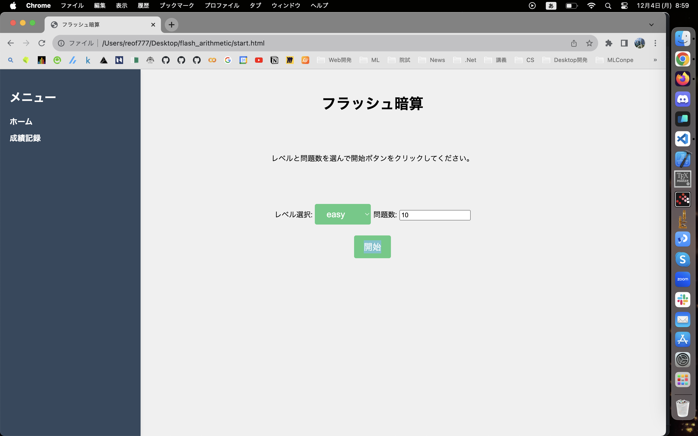

# フラッシュ暗算アプリ

## 概要

フラッシュ暗算アプリは、素早く正確な暗算能力を養うためのアプリケーションです。ユーザーは制限時間内にできるだけ多くの数学の問題に回答し、その正確性とスピードを向上させることが目的です。

## 機能

- ユーザーは制限時間内にできるだけ多くの暗算問題に回答します。
- 問題は加算、減算、乗算、除算などの基本的な数学演算を含みます。
- ユーザーは正解数と経過時間を追跡できます。
- インタラクティブで使いやすいユーザーインターフェース。

## インストール

1. リポジトリをクローンします。
   ```bash
   git clone https://github.com/your-username/flash-mental-math-app.git
   ```

2. プロジェクトのディレクトリに移動します。

    ```bash
    cd flash-mental-math-app
    ```

3. main.htmlをブラウザで開いてください。




## 使用技術

1. html
2. css
3. javascript

